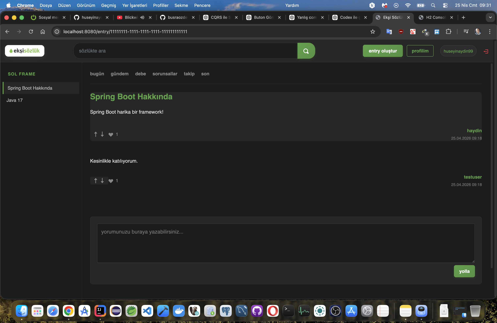
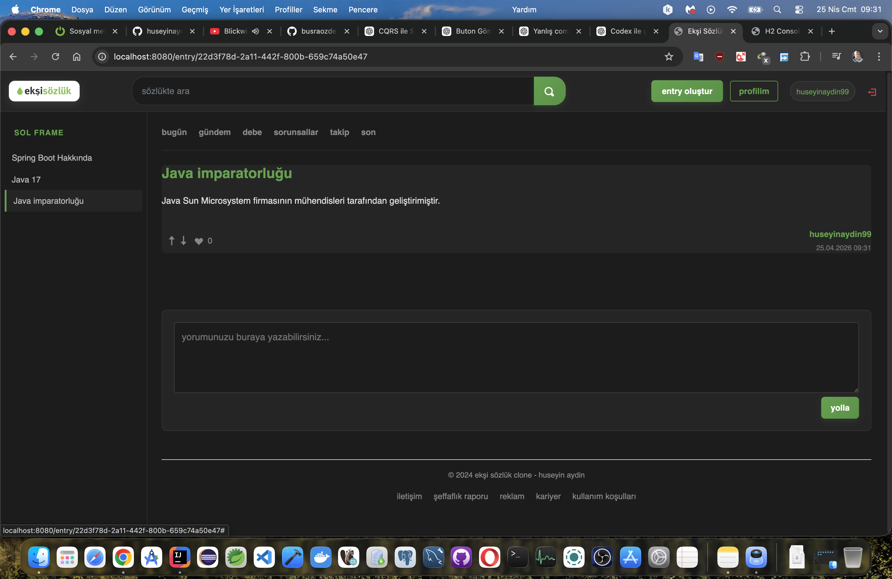
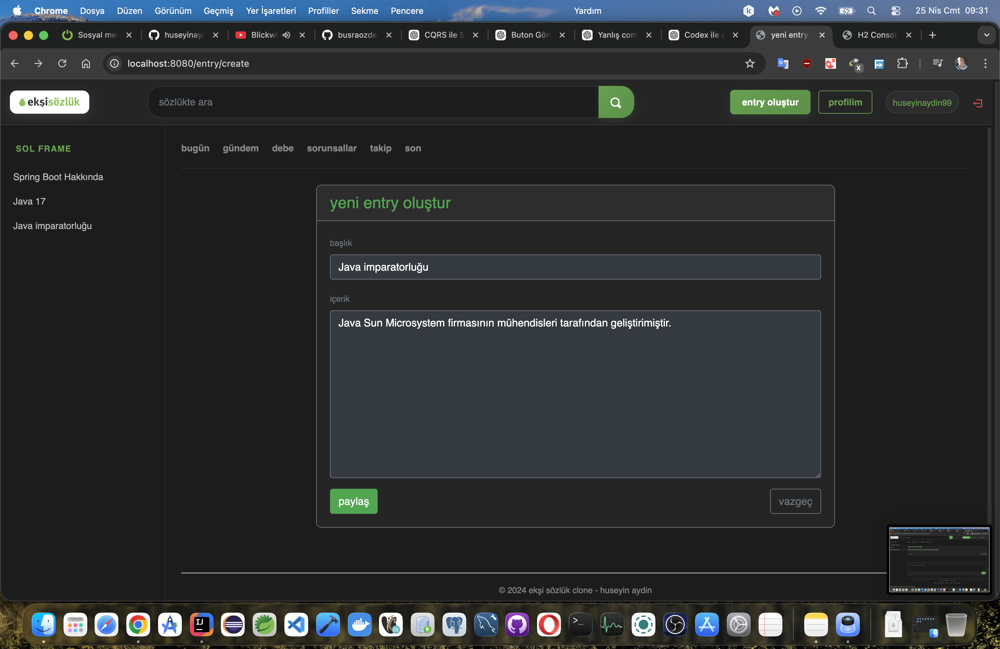
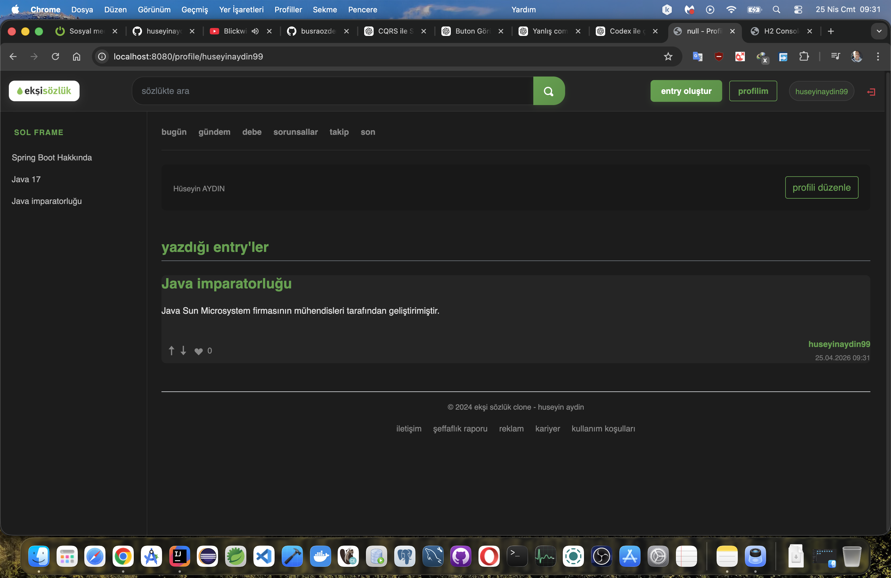
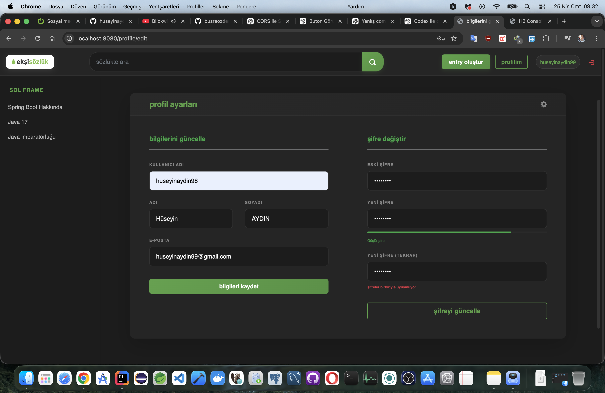
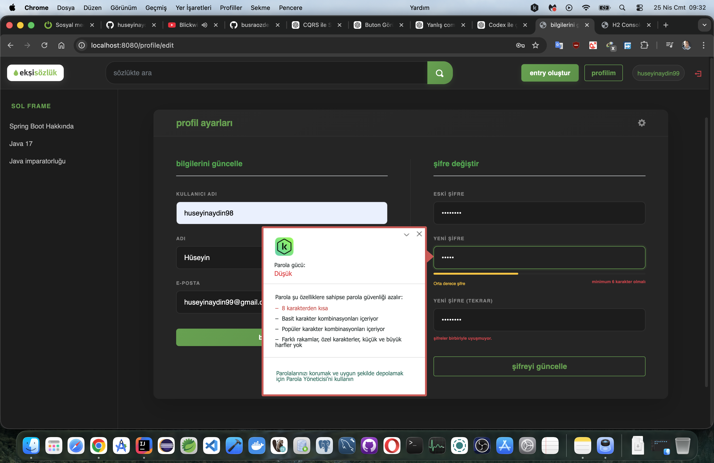
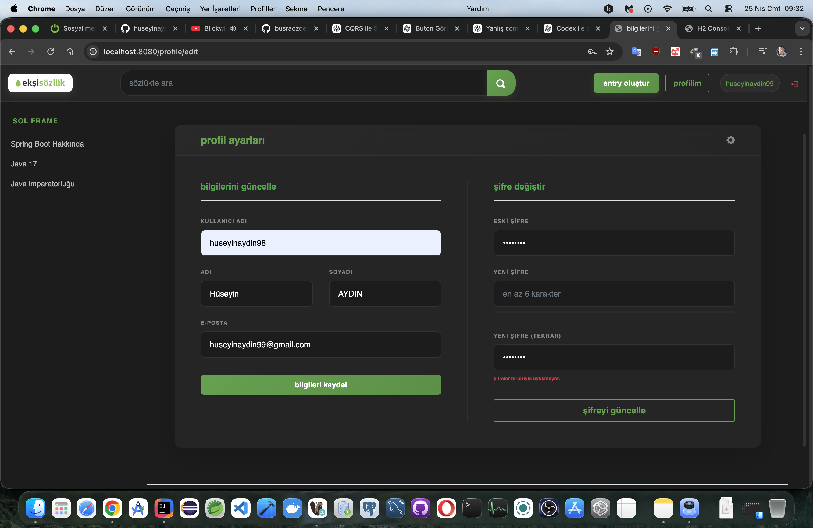
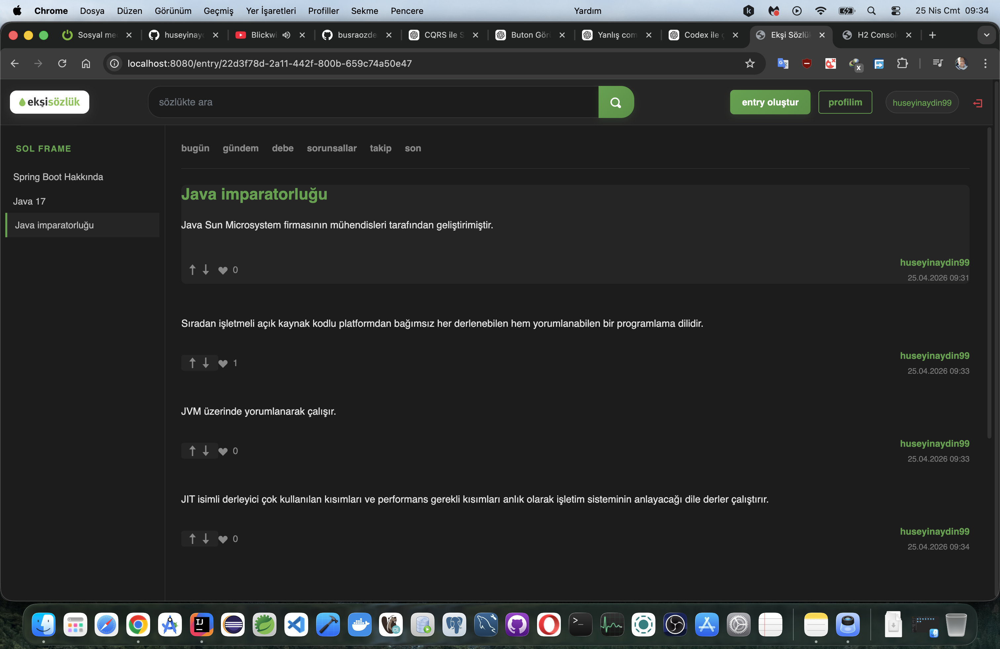

#### Proje Hakkında

Bu proje, Ekşi Sözlük benzeri bir içerik platformunun backend mimarisini **Spring Boot ekosistemi** üzerinde modern yazılım tasarım prensipleriyle yeniden inşa etmek amacıyla geliştirilmiştir. Amaç yalnızca çalışan bir uygulama üretmek değil; **ölçeklenebilir, bakımı kolay, test edilebilir ve katmanlı bir sistem mimarisi** oluşturmaktır.

---

### 📸 Proje Görselleri

---

### 🧩 Mimari Yaklaşım

Sistem, Onion Architecture prensipleri temel alınarak katmanlı bir yapı üzerinde tasarlanmıştır 🧅  
Buradaki ana amaç, iş mantığını framework ve altyapı bağımlılıklarından ayrıştırarak, sistemin zaman içinde değişen gereksinimlere karşı daha kontrollü ve sürdürülebilir bir şekilde evrilebilmesini sağlamaktır.

---

### 🧠 Domain Layer

Domain katmanı sistemin merkezini oluşturur ve tüm iş kurallarının tanımlandığı en saf katman olarak konumlanır 🧠  
Bu katmanda amaç, teknolojik detaylardan tamamen bağımsız bir iş modeli oluşturmak ve sistemi yalnızca problem alanına odaklamaktır.

- İş kuralları bu katmanda tanımlanır ve sistem davranışının doğruluğunu belirler 🔐
- Entity ve Value Object yapıları, iş domain’ini teknik bağımlılıklardan bağımsız şekilde temsil eder 🧩
- Bu katman, framework veya veri erişim detaylarından etkilenmeden çalışacak şekilde izole edilmiştir 🚫

---

### ⚙️ Application Layer

Application katmanı, domain üzerinde tanımlı kuralların gerçek iş senaryolarına dönüştürüldüğü katmandır 🎼  
Bu katmanda doğrudan iş kuralı yazmak yerine, mevcut domain davranışları kullanılarak sistem akışı orkestre edilir.

- Use-case yapıları burada tanımlanır ve her bir iş senaryosu bağımsız bir operasyon olarak ele alınır 📌
- CQRS yaklaşımı doğrultusunda command ve query sorumlulukları ayrıştırılarak uygulanır ⚡
- Sistem içerisindeki iş akışları, doğru sırada ve kontrollü şekilde ilerleyecek biçimde koordine edilir 🎯

---

### 🛠️ Infrastructure Layer

Infrastructure katmanı, sistemin dış dünya ile olan tüm teknik etkileşimlerini yöneten katmandır 🌐  
Burada amaç, domain ve application katmanlarının ihtiyaç duyduğu teknik servisleri somut implementasyonlara dönüştürmektir.

- JPA / Hibernate üzerinden veri erişim mekanizması yönetilir 🗄️
- Spring Security ile authentication ve authorization süreçleri kontrol edilir 🔐
- JWT tabanlı stateless güvenlik modeli uygulanır 🪪
- Global exception handling ve RabbitMQ / Kafka gibi mesajlaşma altyapıları bu katmanda konumlanır 📡

---

### 🌐 Presentation Layer

Presentation katmanı, sistemin dış dünya ile temas ettiği giriş noktasıdır 🚪  
Bu katmanda temel hedef, gelen istekleri minimal şekilde karşılayıp iş mantığını application katmanına devretmektir.

- REST API endpoint’leri bu katmanda tanımlanır 🌍
- HTTP request’leri uygun use-case yapılarına yönlendirilir 📤
- Response üretimi standart veri modelleri üzerinden gerçekleştirilir 📦

---

## 🔗 Bağımlılık Yönü

Sistem mimarisinde bağımlılık yönü merkezden dışa doğru olacak şekilde tasarlanmıştır 🔄  
Domain katmanı herhangi bir framework, veri tabanı veya dış sistem bağımlılığı içermez ve tamamen izole şekilde çalışır.  
Dış katmanlar ise iç katmanlara bağımlı olacak şekilde konumlandırılarak, sistemin kontrol edilebilirliği ve değişime dayanıklılığı artırılmıştır.

---

### ⚡ CQRS (Command Query Responsibility Segregation)

Sistemde yazma ve okuma operasyonları birbirinden ayrıştırılarak modellenmiştir ✂️  
Bu ayrım, hem performans hem de sorumluluk dağılımı açısından daha kontrollü bir yapı elde edilmesini sağlar.

- **Command Side**
  - Veri üzerinde değişiklik yapan operasyonları kapsar (create, update, delete) ✍️
  - Business rule ve validation süreçleri bu tarafta yürütülür 🛡️

- **Query Side**
  - Veri okuma işlemleri için optimize edilmiş yapıyı temsil eder 📖
  - Performans odaklı ve sadeleştirilmiş sorgular bu tarafta yer alır 🚀

Bu yapı sayesinde okuma ve yazma modelleri birbirinden bağımsız şekilde geliştirilebilir hale gelmiş, sistemin ölçeklenebilirliği artırılmıştır.

---

### 🧭 Mediator Pattern (Spring Context + CQRS Handler Yapısı)

Spring Boot mimarisi içerisinde Mediator yaklaşımı, controller ile business logic arasındaki doğrudan bağı kaldırarak merkezi bir request yönlendirme yapısı oluşturmak için kullanılmıştır 🎯

Bu yapı sayesinde istekler doğrudan servis katmanına gitmek yerine command veya query yapıları üzerinden ilgili handler’lara yönlendirilir.

Controller → Command/Query → Handler → Domain → Infrastructure 🔄

Bu tasarım ile:

- Controller katmanı yalnızca giriş noktası olarak sadeleştirilmiştir 📉
- Business logic handler seviyesinde merkezi hale getirilmiştir 🧠
- Katmanlar arası bağımlılıklar azaltılmış ve daha gevşek bir yapı elde edilmiştir 🔗
- Sistem genelinde test edilebilirlik ve kontrol edilebilirlik artırılmıştır 🧪

## 📏 SOLID Prensipleri

Sistem tasarımında SOLID prensipleri, yalnızca teorik bir rehber olarak değil; sınıf tasarımı, katman ayrımı ve bağımlılık yönetimi kararlarını doğrudan etkileyen temel bir mimari disiplin olarak uygulanmıştır 🧱

- **S — Single Responsibility Principle**
  Her sınıf yalnızca tek bir sorumluluğa sahip olacak şekilde tasarlanmıştır 🎯  
  Bir sınıfın değişme nedeni de tek bir iş sebebi ile sınırlıdır; böylece kodun bakım maliyeti ve yan etki riski minimize edilmiştir.

- **O — Open/Closed Principle**
  Sistem bileşenleri genişletmeye açık, ancak mevcut davranışları değiştirmeye kapalı olacak şekilde kurgulanmıştır 🔓  
  Yeni gereksinimler mevcut kodu bozmadan, yeni implementasyonlar veya stratejiler eklenerek karşılanır.

- **L — Liskov Substitution Principle**
  Alt sınıflar, üst sınıfların yerine geçtiklerinde sistem davranışını bozmadan çalışacak şekilde tasarlanmıştır 🔁  
  Bu sayede inheritance yapısı güvenli ve öngörülebilir bir şekilde kullanılmaktadır.

- **I — Interface Segregation Principle**
  Büyük ve genel arayüzler yerine, sorumluluğu daraltılmış ve amaca özel interface yapıları tercih edilmiştir 🧩  
  Böylece sınıflar yalnızca gerçekten ihtiyaç duydukları davranışlara bağımlı hale getirilmiştir.

- **D — Dependency Inversion Principle**
  Üst seviye modüller somut sınıflara değil, soyutlamalara bağımlı olacak şekilde tasarlanmıştır 🧠  
  Bağımlılıklar interface seviyesinde yönetilerek framework ve altyapı bağımlılığı minimuma indirilmiştir.

---

### 🧰 Kullanılan Teknolojiler

- Java 17 ☕
- Spring Boot 3.x 🌱
- Spring Web (REST API) 🌐
- Spring Security 🔐
- JWT Authentication 🪪
- Spring Data JPA (Hibernate) 🗄️
- MySQL / H2 Database 💾
- MapStruct 🔄
- Lombok 🧾
- Swagger / OpenAPI 📘
- Maven ⚙️
- HTML / CSS / Bootstrap 🎨

---

### 🧾 Veri Erişim Stratejisi

Sistem içerisinde veri erişimi tek tip bir yaklaşım yerine, kullanım senaryosuna göre ayrıştırılmış hibrit bir model üzerine kurulmuştur ⚖️  
Amaç, hem domain odaklı geliştirme kolaylığını korumak hem de performans gerektiren noktalarda kontrolü kaybetmemektir 🎯

- **Spring Data JPA**
  - Entity yaşam döngüsünün yönetimi 🧩
  - Transactional write işlemlerinin güvenli yürütülmesi 🔐
  - Domain model ile ORM katmanı arasında tutarlı soyutlama ⚙️

- **Native Query & JPQL/HQL tabanlı sorgular**
  - Okuma ağırlıklı ve performans kritik senaryolar 🚀
  - Gereksiz ORM overhead’inden kaçınma ⚡
  - Karmaşık sorgularda doğrudan SQL kontrolü 🧠

Bu yapı sayesinde sistem, yazım kolaylığı ile runtime performansı arasında dengeli bir çizgide tutulmuştur ⚖️  